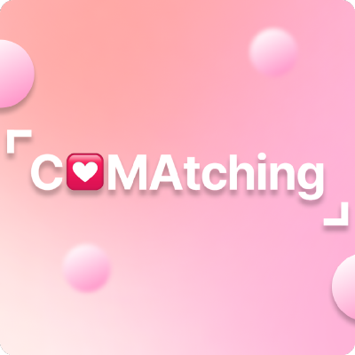
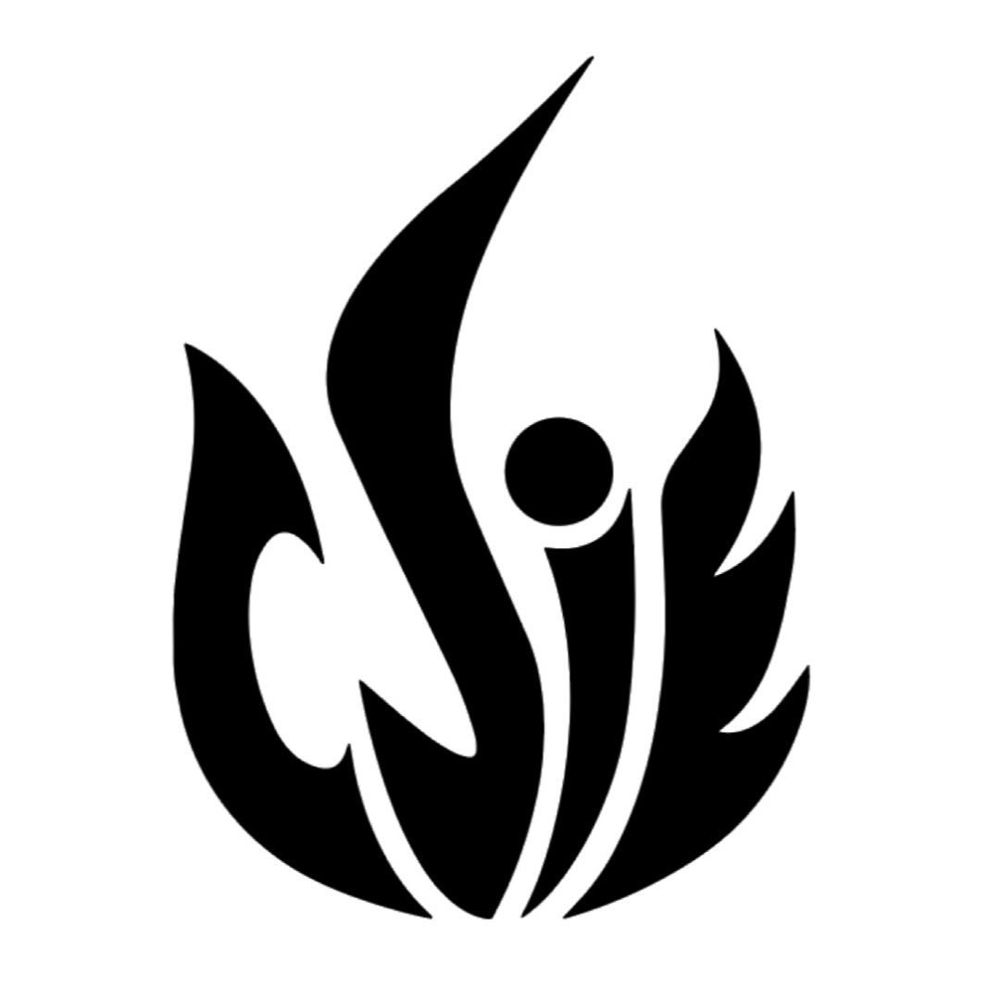
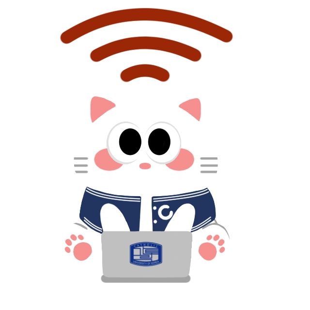

문제를 직접 정의하고 끝까지 푸는 풀스택 개발자입니다.
화면부터 서버 계약, 파이프라인 연동, 인프라까지 — 직접 맡은 범위와 측정 조건을 함께 기록합니다.

**[Portfolio](https://fullstack-portfolio-omega-one.vercel.app/)** · **[Blog](https://ojspp41.tistory.com/)** · ojspp000@naver.com

## Career

<table>
  <tr>
    <td align="center" width="120">
      
    </td>
    <td>
      <b>한솔PNS · AI개발팀 — Full-Stack</b> <code>2025.10 ~ 재직 중</code> 
      13개 계열사 약 <b>1만 명 대상</b> 사내 LLM 서비스 <b>AI Atlas</b> 개발. 입사 후 6개월 안에 팀과 함께 첫 출시. 프론트 오너 구현 + 미터링 조회·사용 한도 제어 API, 파일 미리보기 엔드포인트 등 <b>서버 계약 직접 설계</b>. Go 기반 중앙 API Gateway(gRPC · Kafka · Redis · MinIO)는 설계 의도를 이해하고 연동. 온프레미스(폐쇄망).
    </td>
  </tr>
  <tr>
    <td align="center" width="120">
      
    </td>
    <td>
      <b>펑타이그레이터차이나 유한회사 (PTKOREA) — Full-Stack Intern</b> <code>2025.06.23 – 2025.10.01</code> 
      삼성닷컴 96개국 글로벌 사이트 QA 자동화. DNT(브랜드명 번역 오류) 일괄 검증 시스템으로 월 10시간+ 수작업 절감, 초기 로딩 65% 단축(3.7s → 1.3s), 폐쇄망 Electron 사내 앱 개발.
    </td>
  </tr>
</table>

## Projects

<table>
  <tr>
    <td align="center" width="120">
      
    </td>
    <td>
      <b><a href="https://fullstack-portfolio-omega-one.vercel.app/">AI Atlas</a></b> — 한솔그룹 사내 LLM 서비스 · Full-Stack <code>2025.10 ~</code> 
      13개 계열사 약 1만 명 대상 · 입사 후 6개월 안에 팀과 함께 첫 출시 · 프론트 오너 + 미터링/미리보기 서버 계약 직접 설계 · 온프레미스(폐쇄망)
    </td>
  </tr>
  <tr>
    <td align="center" width="120">
      
    </td>
    <td>
      <b><a href="https://github.com/githru/githru-vscode-ext">Githru VSCode Extension</a></b> — 오픈소스 컨트리뷰션 🥇 <code>2025.06–2025.12</code> 
      렌더링 18.9% 개선 · 변동성 93% 감소 (PR #812) → <b>과학기술정보통신부 장관상</b>
    </td>
  </tr>
  <tr>
    <td align="center" width="120">
      
    </td>
    <td>
      <b>Favus</b> — S3 멀티파트 업로드 도구 · 팀장 🥈 <code>2025.06–2025.09</code> 
      Go 병렬 청킹 + 상태 저장 → 대용량 전송 실패율 90%↓ → <b>오픈소스 개발자 대회 우수작</b> (직장인 부문)
    </td>
  </tr>
  <tr>
    <td align="center" width="120">
      
    </td>
    <td>
      <b><a href="https://github.com/COMAtching">COMAtching</a></b> — AI 매칭 서비스 창업 · 팀장 <code>2023.06–2025.05</code> 
      2년 운영 · 누적 2,000명 · 매출 800만 원 · MySQL 스키마 설계 · Toss 결제 멱등성 · Docker/Jenkins CI/CD
    </td>
  </tr>
  <tr>
    <td align="center" width="120">
      
    </td>
    <td>
      <b><a href="https://github.com/COMAtching/COMATCHING_FC_FE">부천 FC | AI 응원 매칭</a></b> — 기업 협업 <code>2024.09–2024.10</code> 
      경기장 실서비스 배포 · 700명 참여 · QR 인증 → 성향 분석 → 매칭 전체 플로우 단독 설계
    </td>
  </tr>
  <tr>
    <td align="center" width="120">
      
    </td>
    <td>
      <b><a href="https://github.com/ojspp41/Meeting_Room">Meeting Room</a></b> — 빈 강의실 · 도서관 좌석 시각화 
      GGUM 교내 해커톤 우수상 (React · TS)
    </td>
  </tr>
  <tr>
    <td align="center" width="120">
      
    </td>
    <td>
      <b><a href="https://github.com/ojspp41/Catspot_front">CatSpot</a></b> — 교내 사이드 프로젝트 
      프론트엔드 개발
    </td>
  </tr>
</table>

 

## Stack

**Frontend** — React 19 · Next.js 15 · TypeScript (strict) · Tailwind v4 · Zustand · TanStack Query · WebSocket/STOMP
**Backend** — Go 1.24 · Gin · gRPC · Protobuf · Kafka · Redis · MongoDB · MySQL · MinIO
**AI/LLM** — LLM Streaming · Generative UI · RAG · Progressive Markdown Parser · MCP
**Infra** — Docker Multi-stage · Kubernetes · CI/CD · Jest · Playwright · 폐쇄망 배포

## Numbers

| 성과 | 수치 | 근거 |
|---|---|---|
| 미터링 조회 API | `1,970ms → 2.6ms` | 300만 건 재현 데이터 조회 · API/FE 구현과 공통 집계 기반 연동 |
| 응답 폭주 시 리렌더 | `99.6%↓` | 고정 폭주 패턴 · React Profiler 화면 갱신 횟수 |
| Docker 이미지 | `3.63GB → 1.82GB` | 숨은 회귀 1.56GB 레이어 측정 적발 |
| 깨진 JSON 회복률 | `60% → 97.5%` | 동일 40개 고정 입력 전후 테스트 |
| 오픈소스 기여 | `장관상` | 과학기술정보통신부 · Githru |
| 창업 서비스 | `2,000명 · 매출 800만` | COMAtching 2년 운영 |

## Deep Dives

상세 사례 8개를 **아키텍처 → 문제·목표 → 해결 과정 → 결과** 순서로 정리했습니다. 페이지마다 담당 범위와 검증 조건·현재 한계를 표시합니다.

- [SLP · MES 생산 리포팅 Agent](https://fullstack-portfolio-omega-one.vercel.app/?p=slp-reporting) — 읽기 전용 MCP 도구·기간 비교·근거가 담긴 HTML 보고서.
- [사용량·비용 미터링 백오피스](https://fullstack-portfolio-omega-one.vercel.app/?p=metering) — 조회·비교·한도 API와 화면·Excel·인보이스. 공통 Kafka 인입·일배치·가격/환율 기반은 연동 범위.
- [조직별 Agent 공유](https://fullstack-portfolio-omega-one.vercel.app/?p=cross-org-sharing) — 사용자·조직·공유자별 승인·실행 재인가·회수·Outbox.
- [파일 인앱 미리보기](https://fullstack-portfolio-omega-one.vercel.app/?p=file-preview) — 원본/처리 사본 통로 분리·현재 처리 세대 선택·PDF 스트리밍. DRM·변환 엔진 연동.
- [Generative UI](https://fullstack-portfolio-omega-one.vercel.app/?p=generative-ui) — 원본 우선 파싱·실패 입력 정제·위젯 오류 격리.
- [WebSocket 안정화](https://fullstack-portfolio-omega-one.vercel.app/?p=websocket) — 연결 생명주기·스트리밍 유지·폭주 패턴 갱신 감소.
- [Docker 이미지 개선](https://fullstack-portfolio-omega-one.vercel.app/?p=dockerfile) — 레이어 분석·APM 설치 분리·Non-root 부팅과 기능 검증.
- [채팅 목록 조회 개선](https://fullstack-portfolio-omega-one.vercel.app/?p=session-list) — projection·권한 재검증·복합 인덱스·로딩 상태. 로컬 합성 데이터 조회 결과.

## AI 활용 경험

1. **개발 품질 관리 · 루프·하네스 엔지니어링** — AI로 분석·구현·테스트를 보조하고 실제 화면·리뷰·배포로 확인합니다. 입력·완료 기준·검증 규칙을 재사용 절차로 만들고 실패를 회귀 테스트에 반영합니다.
2. **운영보고 자동화** — API 수치·기간·합계는 코드로 검증하고 AI는 변화 설명을 작성합니다. 기록된 생성·검증 업무 약 2~3시간 → 10분 이내.
3. **가이드·웹 문서 연계** — 실제 화면 캡처·주석·Confluence 가이드를 AX Campus 목차·색인·링크·이미지 참조와 연결합니다.
4. **화면설계서·테스트케이스** — AI로 HWP 구성·테스트 작성을 보조한 뒤 실제 실행·중복·누락·최종 문구를 확인합니다.
5. **Excel 가공·분석 지원** — AI로 코드·설명을 보조하고 계산·출력·수치 검수는 코드와 직접 확인으로 수행합니다.

## Education · Certifications

가톨릭대학교 컴퓨터정보공학과 · 2020.03–2026.02 · 학점 **4.05/4.5**

정보처리기사(2025.09.12) · OPIc IH(2025.08.28) · 컴퓨터활용능력 2급(2021.04.09) · 운전면허 1종 보통(2023.12.04)

## Awards

- **학업성적우등상** — 가톨릭대학교 · 2026.02.11
- **오픈소스 개발자 대회 우수작** — Favus · 2025.12.21
- **오픈소스 컨트리뷰션 아카데미 우수상 / 과학기술정보통신부 장관상** — Githru · 2025.12.05
- **Programming 대회 은상** — 가톨릭대학교 · 2024.10.26
- **GGUM 해커톤 우수상** — 좌석·빈 강의실 시각화 · 2024.10.21

 

measured, not claimed.
